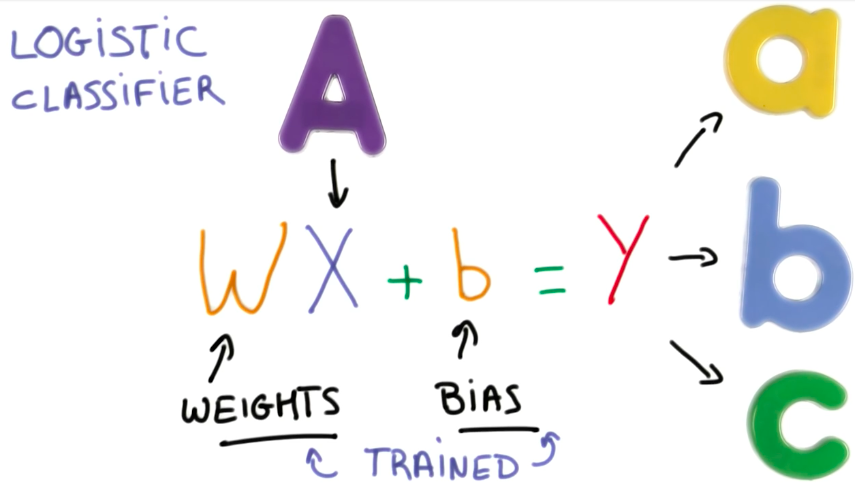
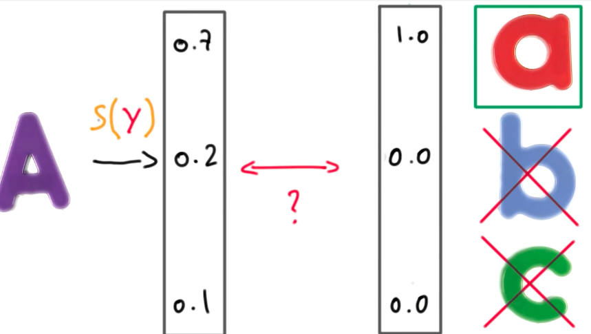
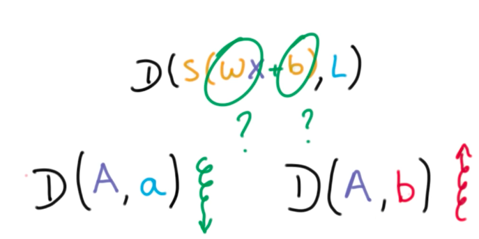
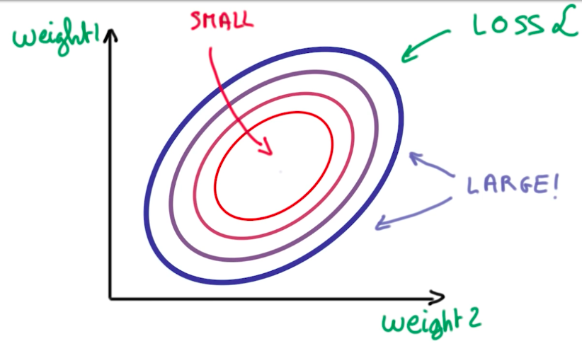
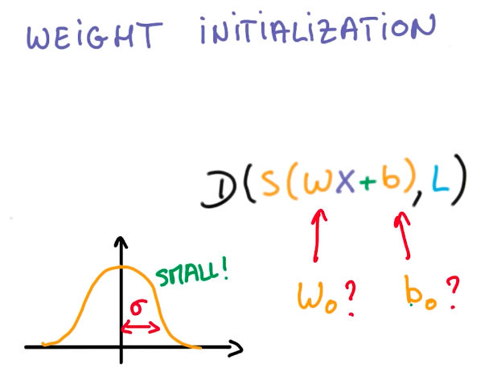

# From Machine Learning to Deep Learning

## Training your Logistic Classifier

A Logistic Classifier is a function that outputs scores for a given input. It is trained by adapting the weights and the bias.

When we train a classifier, we want to output probabilities, instead of scores. This probabilities will be checked against a threshold so that we have a binary classification.

To transform scores into probabilities we can use a softmax function as described below.

## Cross Entropy

## Minimizing Cross Entropy

We want to find the `W` and `b` that provide a high distance to the incorrect class while having a low distance to the correct class.

For this, we define something called `loss function`:

This loss function is the average cross-entropy of all our data, so it is a big expensive operation. To understand how to minimize this function, suppose we could represent it in terms of 2 weights (W and b):

Now we turned our machine learning problem into a numerical optimization problem. We have to find the 2 weights that provide the minimal loss function. And we can do this using gradient descent.

## Normalized Inputs And Initial Weights

When handling big data, we have to be aware of rounding problems, while handling very big and small numbers simultaneously. As a good practice, we want our variables to have zero mean and equal variance, whenever possible.

This well-conditioned variables make it easier for optimizers to find a solution for the problem.

On images, we can normalize the data by subtracting and dividing each channel by 128. This helps the optimizer to converge on a solution faster.

The same idea applies to the weight initialization for the logistic function. Using gaussian distributions and small standard deviations, select the weights. Small sigmas represent more uncertainty, while large sigmas, represent more bias.

So now we know all steps for initializing the Logistic Classifier.

And the optimization steps consist of taking the derivative of the loss function on each weight and updating the weight to its new value, hence and repeat.

