# From Machine Learning to Deep Learning

## Training your Logistic Classifier

A Logistic Classifier is a function that outputs scores for a given input. It is trained by adapting the weights and the bias.

When we train a classifier, we want to output probabilities, instead of scores. This probabilities will be checked against a threshold so that we have a binary classification.

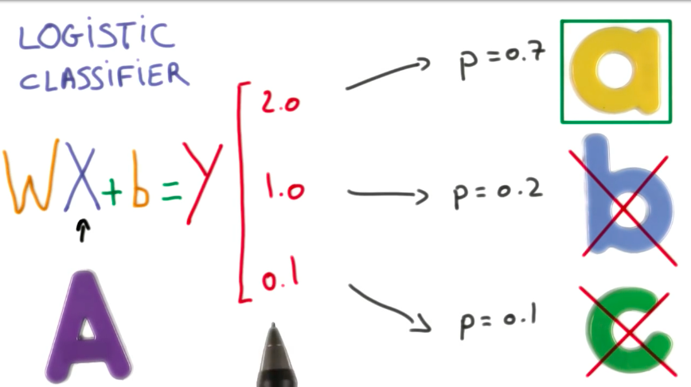

To transform scores into probabilities we can use a softmax function as described below.

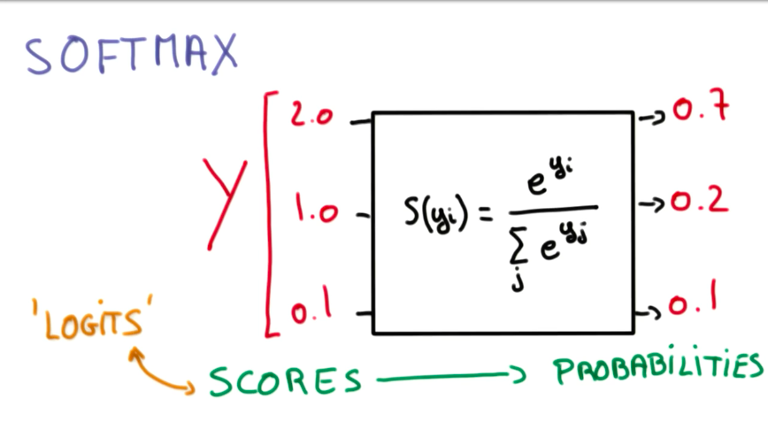

## Cross Entropy

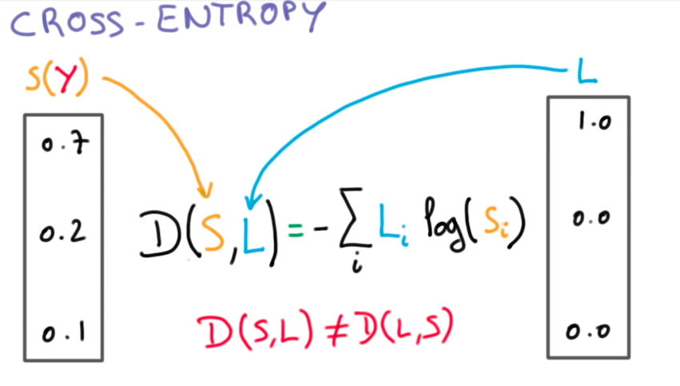

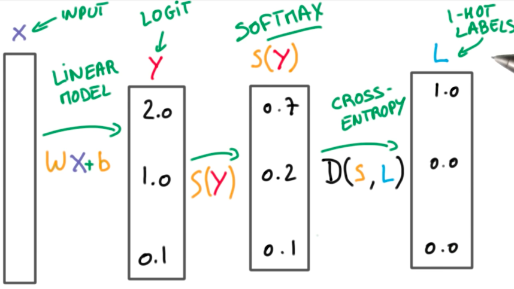

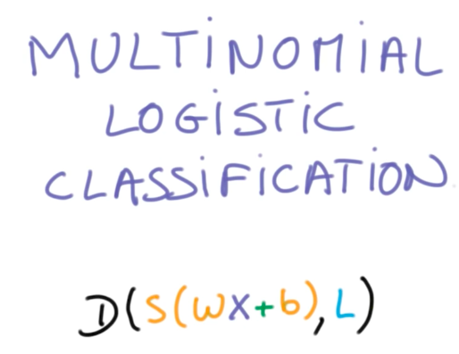

## Minimizing Cross Entropy

We want to find the `W` and `b` that provide a high distance to the incorrect class while having a low distance to the correct class.

For this, we define something called `loss function`:

This loss function is the average cross-entropy of all our data, so it is a big expensive operation. To understand how to minimize this function, suppose we could represent it in terms of 2 weights (W and b):

Now we turned our machine learning problem into a numerical optimization problem. We have to find the 2 weights that provide the minimal loss function. And we can do this using gradient descent.

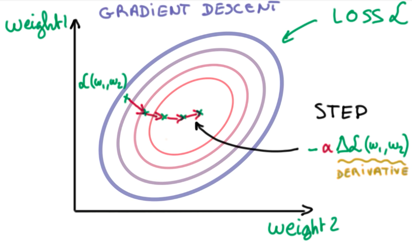

## Normalized Inputs And Initial Weights

When handling big data, we have to be aware of rounding problems, while handling very big and small numbers simultaneously. As a good practice, we want our variables to have zero mean and equal variance, whenever possible.

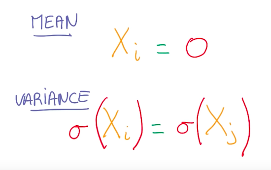

This well-conditioned variables make it easier for optimizers to find a solution for the problem.

On images, we can normalize the data by subtracting and dividing each channel by 128. This helps the optimizer to converge on a solution faster.

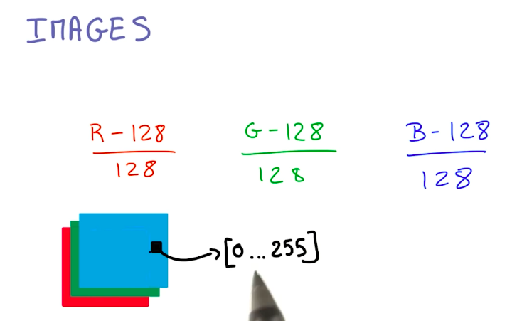

The same idea applies to the weight initialization for the logistic function. Using gaussian distributions and small standard deviations, select the weights. Small sigmas represent more uncertainty, while large sigmas, represent more bias.

So now we know all steps for initializing the Logistic Classifier.

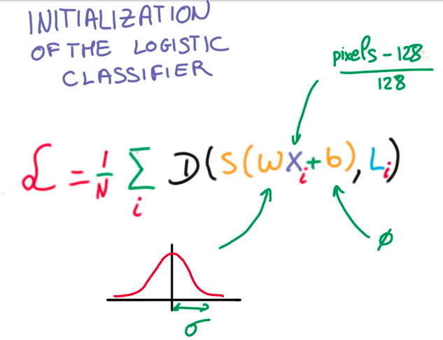

And the optimization steps consist of taking the derivative of the loss function on each weight and updating the weight to its new value, hence and repeat.

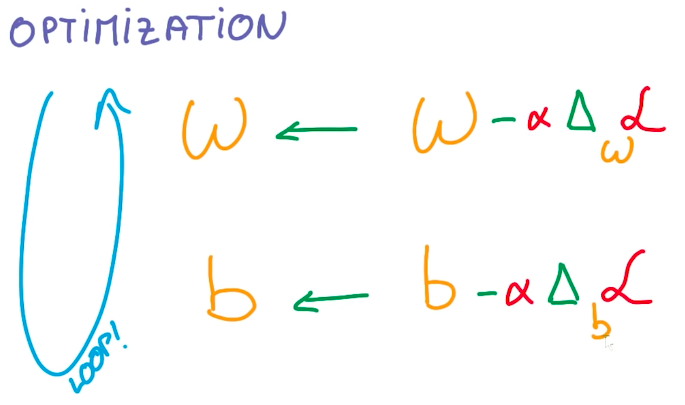

## Validation Test Set Size Continued

As a rule of the thumb, a change in the model that affects the classification of less than 30 samples can be interpreted as noise. In contrast, a change that affects 30 or more samples, can be interpreted as a gain in accuracy for the model. Because of this, a validation set should have at least 30,000 samples, so that we can measure gains of 0.1% in accuracy.

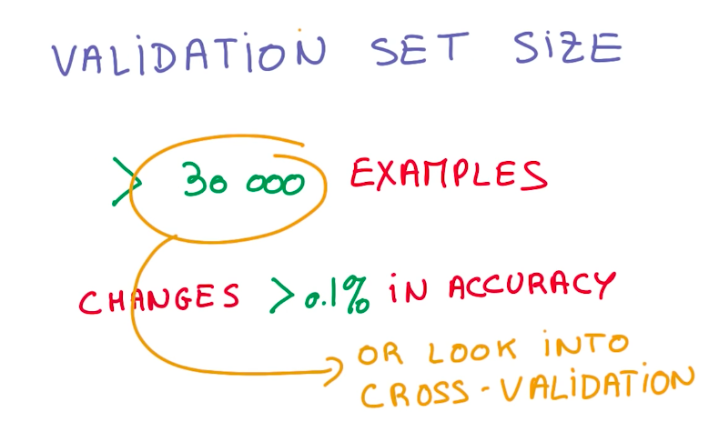

## Stochastic Gradient Descent

Stochastic Gradient Descent is an alternative to Gradient Descent. It is a trade-off in in which we select a tiny random sample from the dataset to compute the global loss function and the derivative faster and, instead of taking tens of large steps to find the minimum optimal function, we take hunderds to thousands smaller steps.

Usually we prefer SGD to GD, because it scales better with model and data size, and we want both on deep learning. The drawback is that SGD have some issues on real-world problems, like the definition of the random sample, and the steps take us into random directions which, sometimes, increase the overall loss.

## Momentum And Learning Rate Decay

To improve SGD results, we need to take a few steps.

First, as stated before, we need to normalize our inputs.

Then we can use `Momentum` and `Learning Rate Decay` to improve convergence.

### Momentum

Momentum is a moving average of the derivatives from the last steps. With momentum, we retain previous knowledge about the direction in which we have to go to get to the minimal loss function. We use momentum instead of the flat value of the derivative on a given step.

### Learning Rate Decay

Learning Rate is the fraction of the derivative we take each step. Learning Rate decay is the amount the learning rate drops each step we take. As a general rule of the thumb, lowering the learning rate over time is key to convergence of the model.

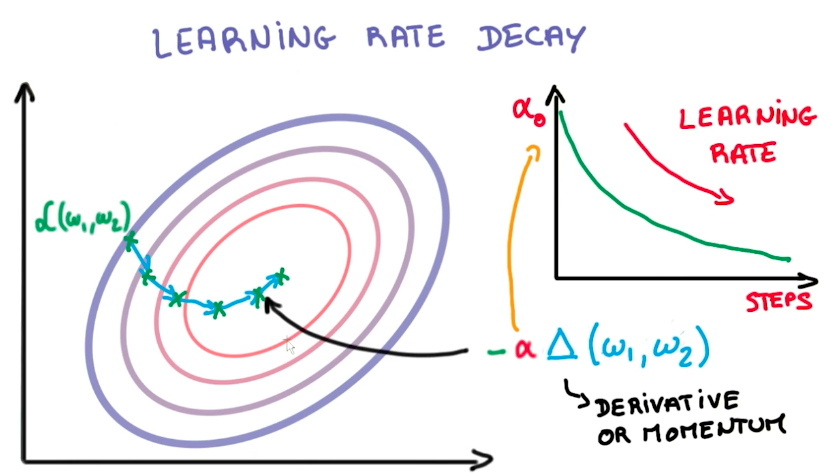

## Parameter Hyperspace

Learning Rate tuning can be very strange. A higher learning rate doesn't mean the model learns more or learns faster. That is not true. In general, a lower learning rate generates better models.

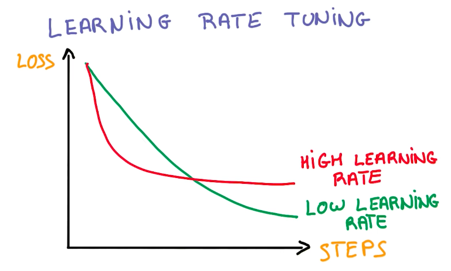

SGD tuning is known as black-magic, because there are many hyperparameters to work with.

There is a simplification of SGD called ADAGRAD, which works out the learning rate and momentum. Usually it doesn't work so well as a handpicked tuned SGD, but it is much simpler to work with.

Although we have seen how to train a Logistic Regression SGD model, it is still a linear model, which might not be the best solution for non-linear problems. Because of this, we need to go deeper into deep learning.

