# Game Theory

## What is Game Theory?

## Simple game

Given the simple game below:

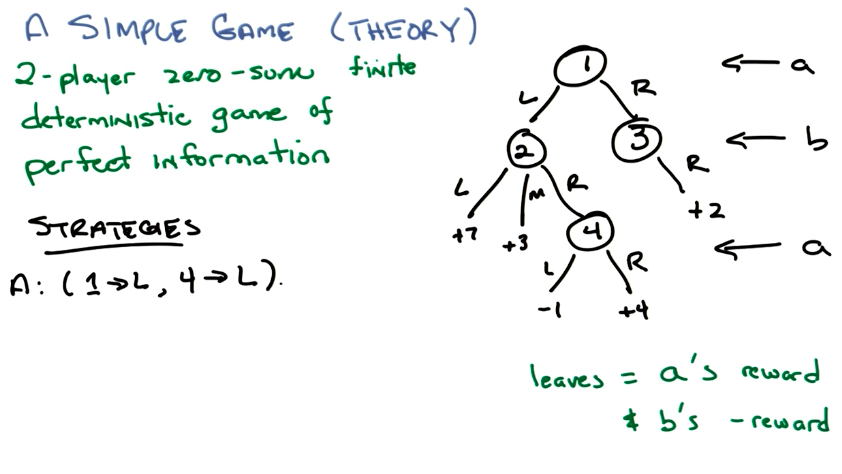

### Minimax

The game-matrix can be calculated as:

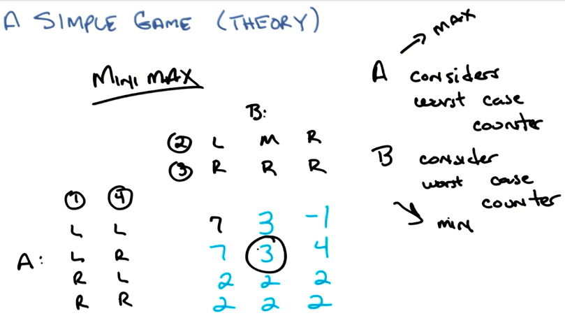

And the result of minimax for this game is `3`, because of the Fundamental Result Theorem.

### Fundamental Result Theorem

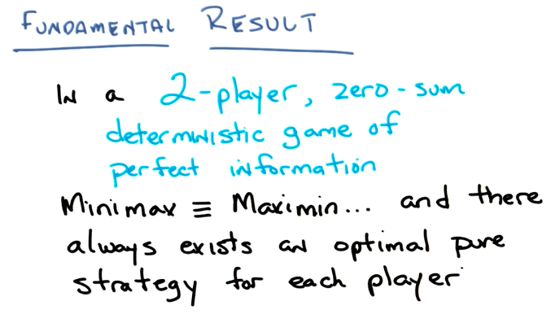

## Non-deterministic Game

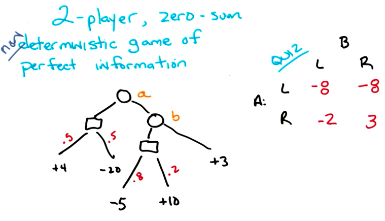

### Von Neumann Theorem

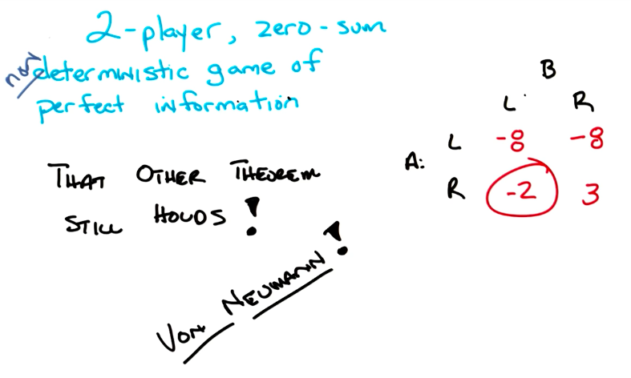

The "Other Theorem" is the Fundamental Result Theorem.

## Hidden information Game

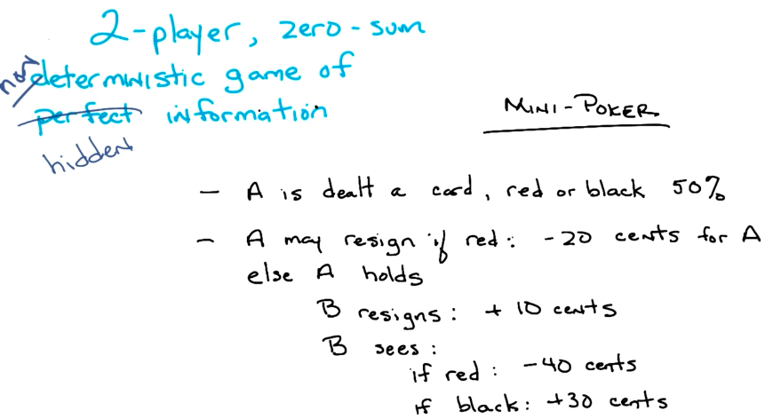

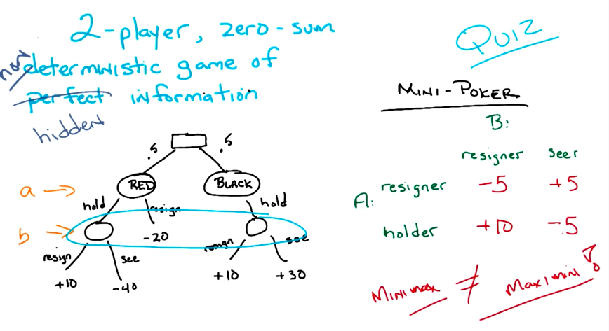

### Mixed Strategy

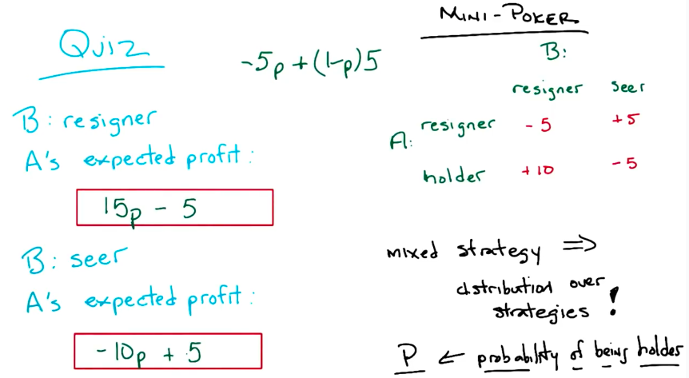

### Mini poker result

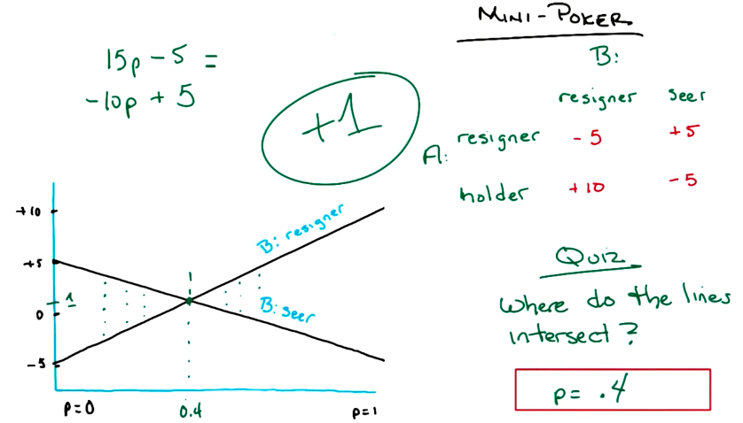

## Prisioner's Dilemma (Non Zero Sum Game)

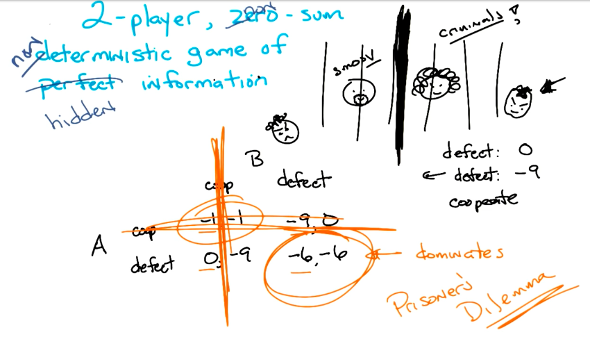

## Nash Equilibrium

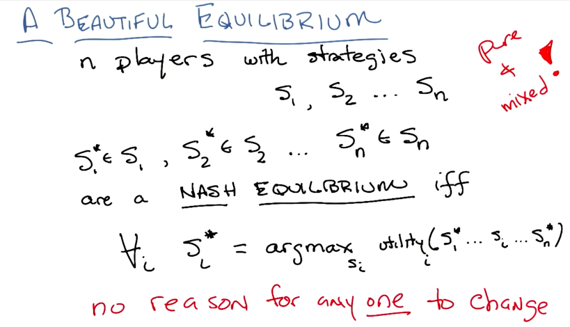

