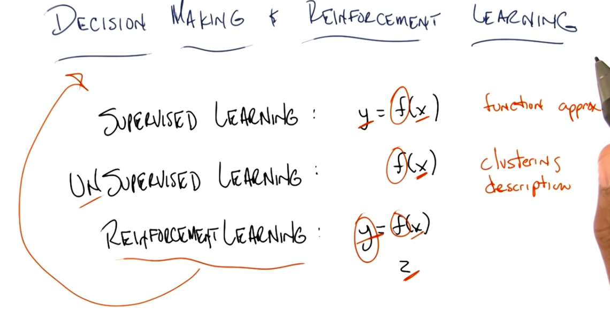

# Markov Decision Process

## Comparison of Learning Types

In *Supervised Learning*, we are given `y` and `x` and we try to find the best function `f` that fits `f(x) = y`.

In *Unsupervised Learning*, we are given `x` and we try to find the best function `f` that produces a compact description of `x` in the form of `f(x)` clusters.

In *Reinforcement Learning*, we are given `x` and `z` and we try to find `f` and `y`, where `f(x) = y`. It looks a lot like supervised learning, but the main difference is that we are not given the labels (`y`), but instead the reinforcers and punishers (`z`) to adjust the function `f`.