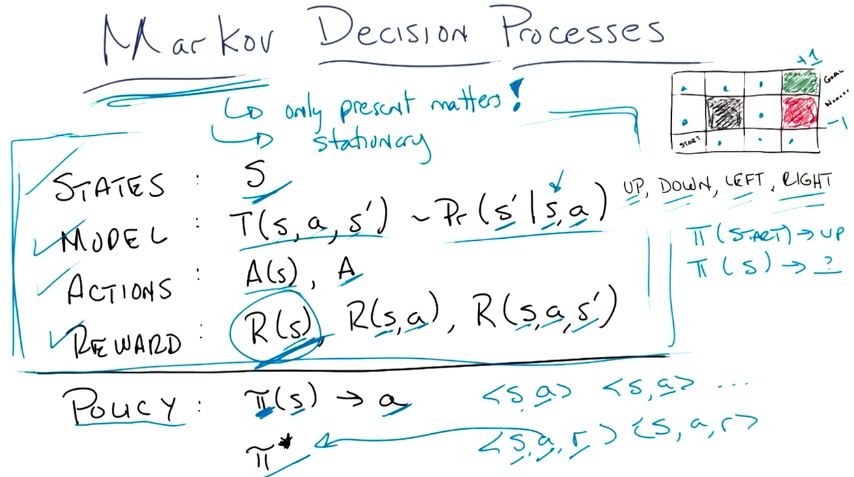
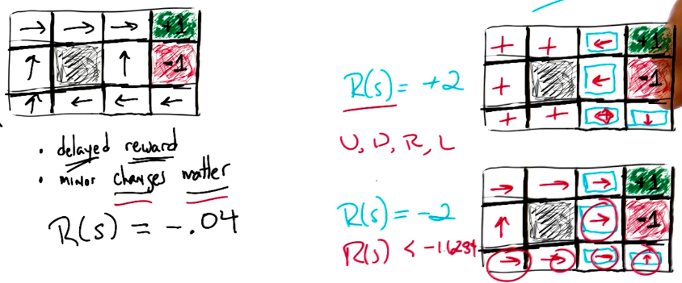
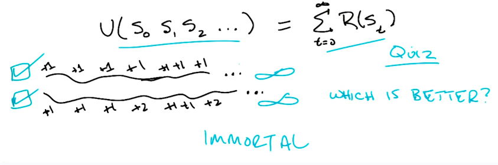
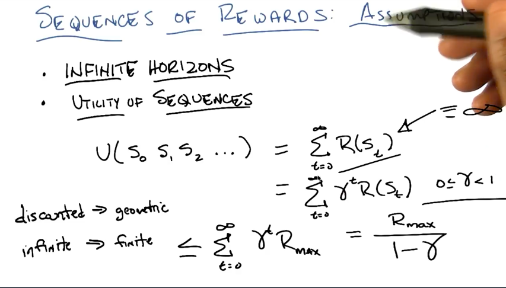
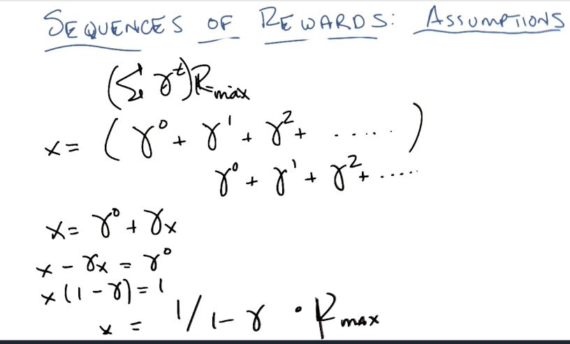
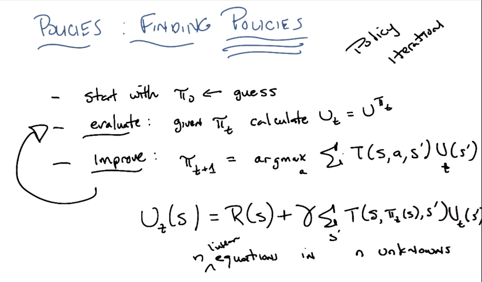
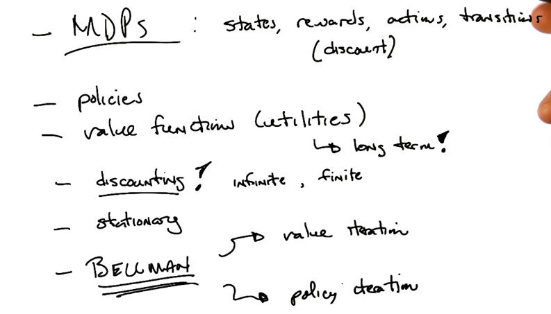

# Markov Decision Process

## Comparison of Learning Types

In *Supervised Learning*, we are given `y` and `x` and we try to find the best function `f` that fits `f(x) = y`.

In *Unsupervised Learning*, we are given `x` and we try to find the best function `f` that produces a compact description of `x` in the form of `f(x)` clusters.

In *Reinforcement Learning*, we are given `x` and `z` and we try to find `f` and `y`, where `f(x) = y`. It looks a lot like supervised learning, but the main difference is that we are not given the labels (`y`), but instead the reinforcers and punishers (`z`) to adjust the function `f`.

## Markov Decision Process Explained

### Markov Assumptions
- Stationary. Actions, states and the model can't change. The agent is the only element of change on the model.
- Only present matters. The transition function should only evaluate the current state to determine the probability of the outcome.

### Image Explained

- States: `S` - represents all the possible states that the agent may be in.
- Model: `T(s, a, s') -> Pr(s' | s, a)` - represents the transition function, which outputs the probability of the agent reaching state `s'` by taking action `a`, given that it is in state `s`.
- Actions: `A(s) or A` - represents all possible actions for each state. Actions are usually constant for all states, so they are represented by `A`.
- Reward  - represents the agent's reward
    - `R(s)`: being on state `s`
    - `R(s,a)`: being on state `s` and taking action `a`
    - `R(s,a,s')`:  being on state `s`, taking action `a` and achieving state `s'`.
    - All these representations provide the same mathematical value and can be modeled by `R(s)` alone.
- Policy - represents the "master plan" to solve the problem. It is represented by a mapping of states to actions `π(s) -> a`, where for any given state `s` it outputs the best course of action `a` to take.
    - `π*` represents the optimal solution - the mapping that maximizes the rewards.

## More on rewards

Some examples of Policies affected by different rewards:

## Sequence of Rewards: Assumptions

### Infinite Horizons

*Infinite Horizons* means we can take as many steps as we want through the MDP.

### Utility of Sequences

*Utility of Sequences* measures the total reward value of a given sequence of steps.

#### Sum of each step reward

)

The sum of all rewards for each step is not a good measure of utility because, assuming we are working with infinite horizons, we will have infinite and all sequences will always provide infinite utility, as shown below.

#### Discounted Rewards

)

Discounted rewards is a geometric sequence that provides a finite number to measure the utility against sequences.

Maximization of discounted rewards:

which is demonstrated by:

## Bellmond Equation

### Algorithmic Solution

### Example (Quiz)

## Finding the Policies

While the solutions presented above find the true Utility Values for each state, we are not interested in finding these values, but instead we are interested in finding the Optimal Policy.

The image below shows a simplification of the solutions elaborated previously to solve this.

## Summary

