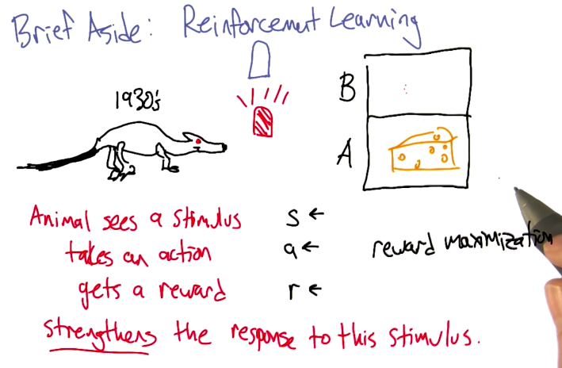
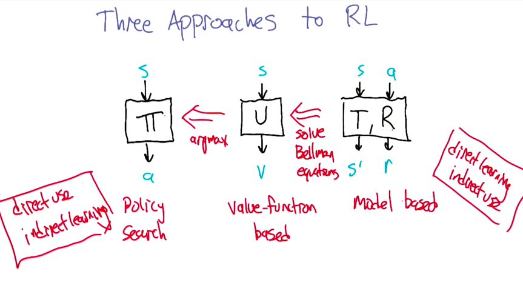
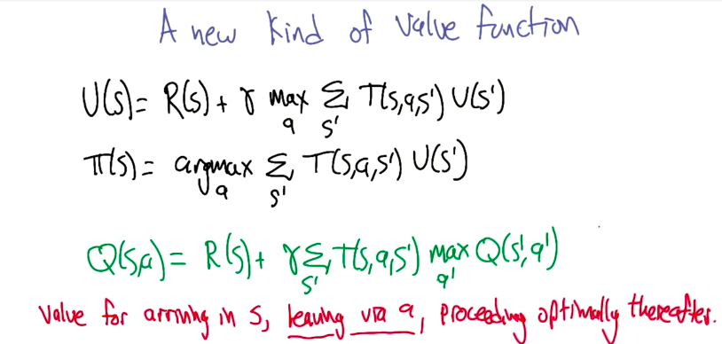
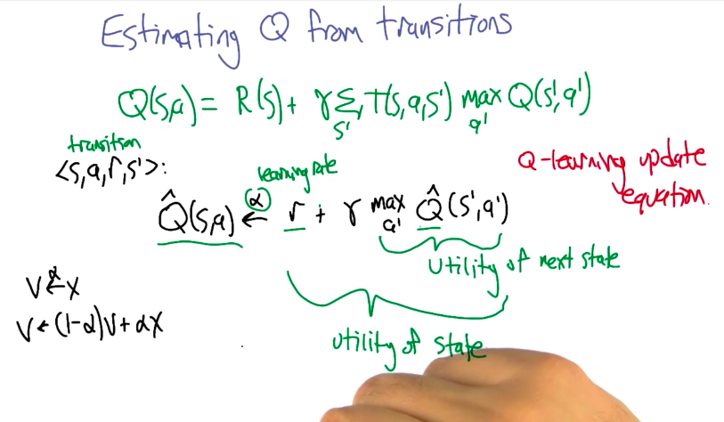
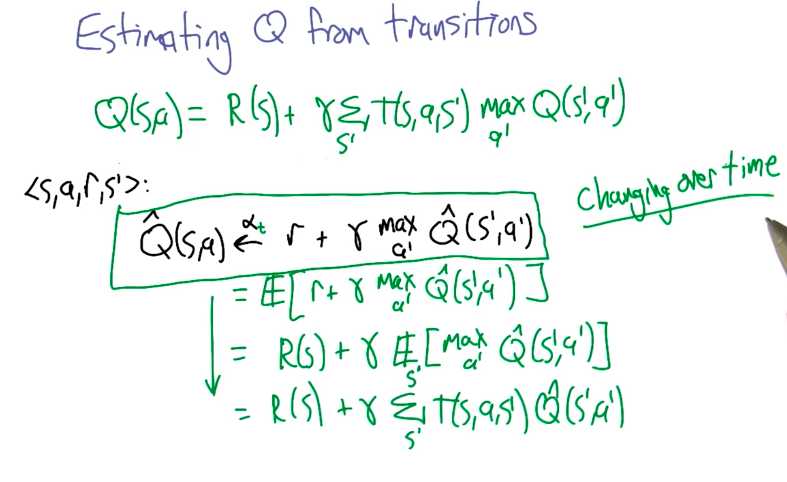
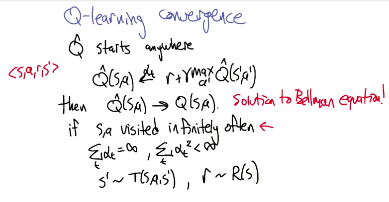
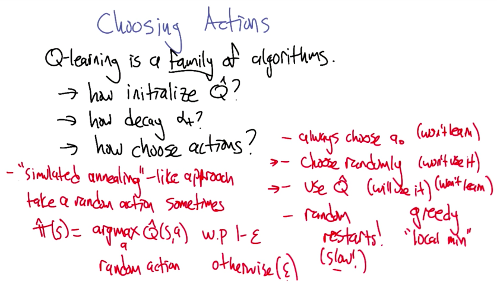

# Reinforcement Learning

## Overview

## Brief History

Side Note: Reinforcement is a misused term, because all we care is to maximize rewards.

## Reinforcement Learning Approaches

## Q Value Function

## Estimating Q

## Q-Learning Convergence

## Choosing Actions

