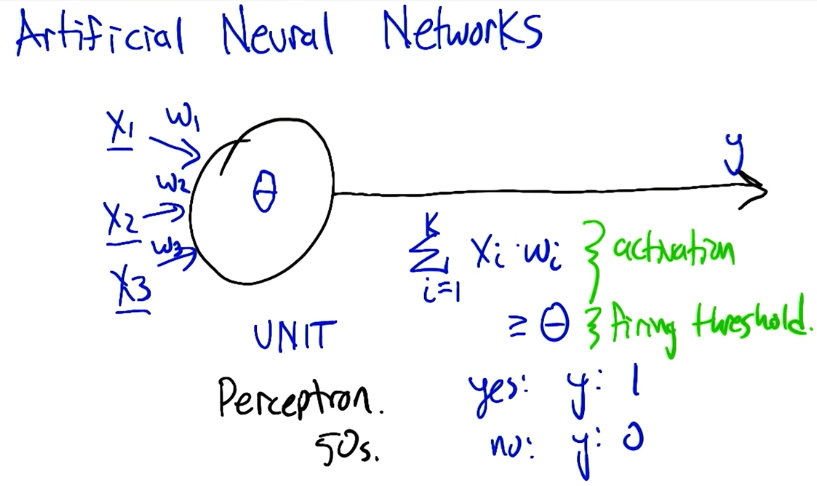
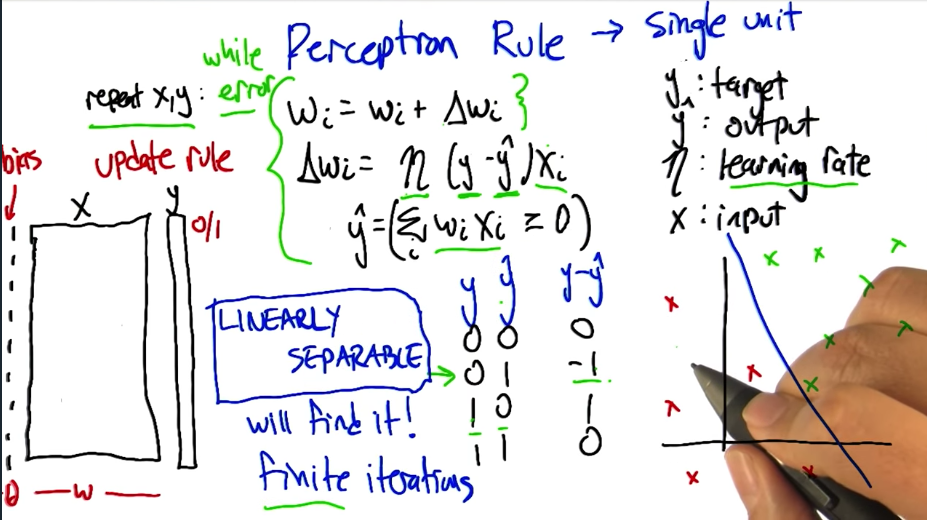
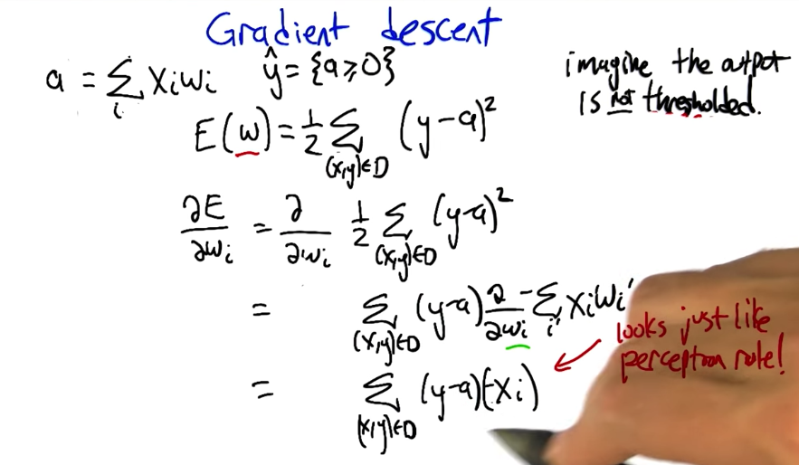
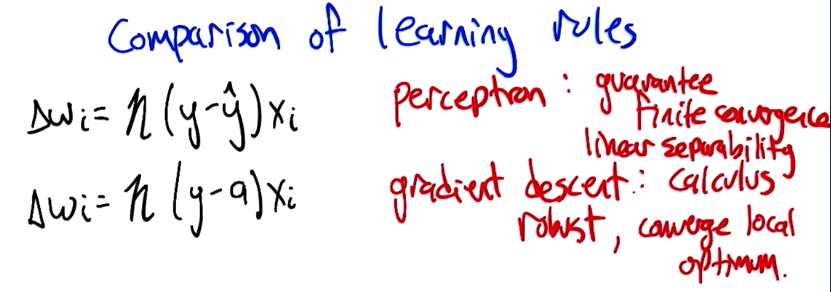
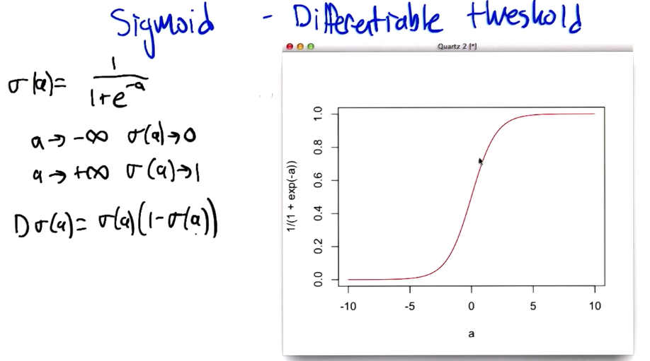
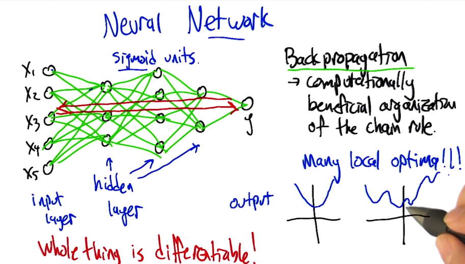
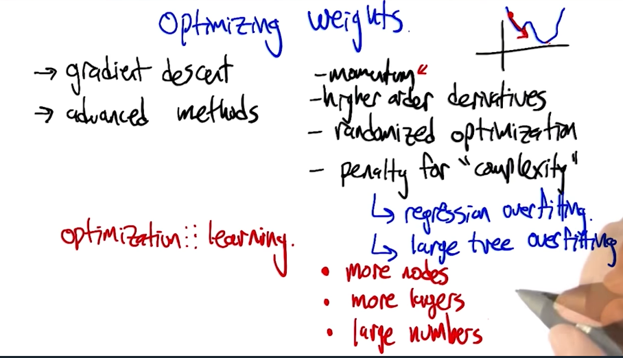
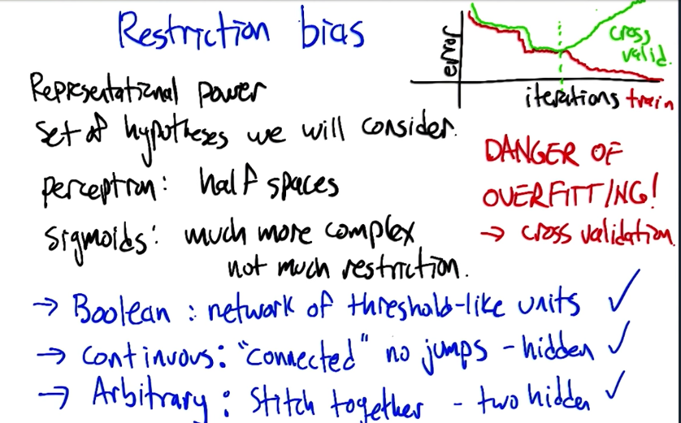
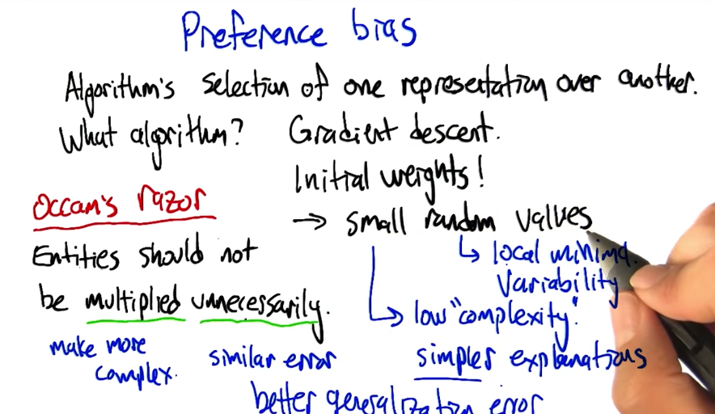
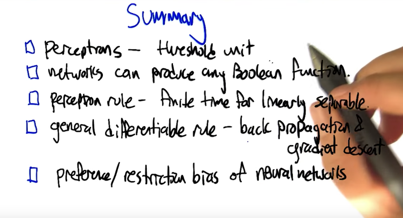

# Artificial Neural Networks

## Perceptrons

### Boolean Operation Perceptrons

These perceptrons can be defined by the W and Θ values. Also note that there are multiple values of W and Θ that implement these operators.

#### AND

| X1 | X2 | W1 | W2 | Θ | Σ X*W | Y | AND |
|----|----|----|----|---|-------|---|-----|   
| 0  | 0  | 1  | 1  | 2 | 0     | 0 | 0   |
| 1  | 0  | 1  | 1  | 2 | 1     | 0 | 0   |
| 0  | 1  | 1  | 1  | 2 | 1     | 0 | 0   |
| 1  | 1  | 1  | 1  | 2 | 2     | 1 | 1   |
 
#### OR

| X1 | X2 | W1 | W2 | Θ | Σ X*W | Y | OR  |
|----|----|----|----|---|-------|---|-----|   
| 0  | 0  | 1  | 1  | 1 | 0     | 0 | 0   |
| 1  | 0  | 1  | 1  | 1 | 1     | 1 | 1   |
| 0  | 1  | 1  | 1  | 1 | 1     | 1 | 1   |
| 1  | 1  | 1  | 1  | 1 | 2     | 1 | 1   |

#### NOT

| X1 | W1 | Θ | Σ X*W | Y | NOT |
|----|----|---|-------|---|-----|   
| 0  | -1 | 0 | 0     | 1 | 1   |
| 1  | -1 | 0 | -1    | 0 | 0   |

#### XOR

| X1 | X2 | X3 (X1 AND X2) | W1 | W2 | W3 | Θ | Σ X*W | Y | XOR |
|----|----|----------------|----|----|----|---|-------|---|-----|   
| 0  | 0  | 0              | 1  | 1  | -2 | 1 | 0     | 0 | 0   |
| 1  | 0  | 0              | 1  | 1  | -2 | 1 | 1     | 1 | 1   |
| 0  | 1  | 0              | 1  | 1  | -2 | 1 | 1     | 1 | 1   |
| 1  | 1  | 1              | 1  | 1  | -2 | 1 | 0     | 0 | 0   |

## Perceptron Training Rule

## Gradient Descent Rule

## Comparison of Learning Rules

## Sigmoid

## Neural Network Sketch / Backpropagation

## Optimizing Weights

## Restriction Bias

## Preference Bias

## Summary
