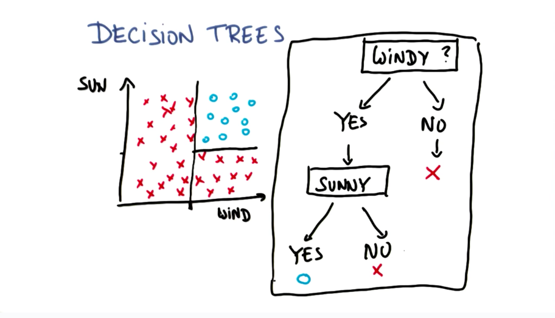

# More decision trees

## Decision tree graph representation



## Decision Trees Accuracy

```python
from sklearn import tree
clf = tree.DecisionTreeClassifier(min_samples_split=10)
clf = clf.fit(features_train, labels_train)

from sklearn.metrics import accuracy_score
acc = accuracy_score(labels_test, clf.predict(features_test)) 
```