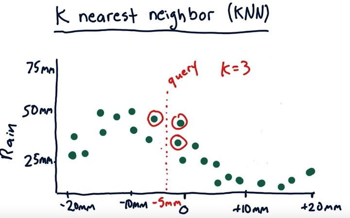

# Supervised Learning

## Supervised Learning, Classification and Regression

Supervised learning is a technique of fitting a model to some labeled input, and then given a new input, the model predicts the output.

There are two types of tasks whiles doing supervised learning: `Classification` and `Regression`.

### Classification

Classification is the task of predicting a discrete output given an input. Example of classification problems are:

- Given a portrait, define if the person is a male or female
- Given some features of a student, define if he is a graduate student, undergraduate or highschool.

### Regression

Regression is the task of predicting a continuous output for a given input. For example:

- Given some info about a person, predict his income.
- Given a portrait, predict the person's age<sup>*</sup>

<sup>*</sup> Although age is usually considered continuous output, depending on the problem, it might be discrete output.

## Types of Regression

### Parametric vs Non-parametric Regression

A **parametric regression** captures all information about the provided data into their own parameters, and then uses these parameters to predict the outputs for a given input.

A **non-parametric regression** uses the data directly to predict the output for a given input.

Parametric regressions take longer to train but less time to give predictions, while non-parametric regressions can be trained faster but require more time to provide the predictions. Also, it is easier to add new data points to a non-parametric regression, since it doesn't need to be trained all over again.

An example of a parametric regression is a **polynomial regression**.

An example of a non-parametric regression is a **kernel regression**.

### Linear Regression

Linear regression is a parametric regression that fits the data to a line. The parameters of the line are found by the following steps:

1. The line is represented by `y = mx + b`. We have to find `m` and `b`, given two sets X and Y.
2. First we compute the mean of X and Y.
3. Then we normalize X and Y (subtract each point by the mean).
4. Then we find `m`. `X` and `Y` below are normalized from step 3.
```
    m = sum(Xi*Yi) / sum(Yi*Yi)
```
5. Finally we find `b`, by the equation:
```
    y - mean_y = m * (x - mean_x)
    y = m * x - m * mean_x + mean_y

    Comparing to y = mx + b, then:

    b = -m * mean_x + y 
```

We can use sklearn to compute the linear regression for us:

```python
    from sklearn.linear_model import LinearRegression
    
    reg = LinearRegression()
    reg.fit(X, Y)

    print "m = ", reg.coef_
    print "b =  ", reg.intercept_
    print "r_squared = ", reg.score(X_test, Y_test)
```

#### Final notes

- `m` is also known as `Slope`
- `b` is also known as `Intercept`

### SSE vs R Squared

Squared Sum Errors (SSE) is the sum of the squared errors. In other words, given a line, we compute the distance between the data points and the line, square it and sum.

R Squared is a value between 0 and 1 that answers the question: "How much of the change in my output (Y) is explained by the change in my input (x)?" In other words, it describes how many cases the given model can explain variations around the mean in %.

It is important to notice that SSE incrases as we add more training data (because for each point added, there will be some error), this doesn't happen with R Squared.

R Squared is defined as:


Where SS<sub>res</sub> is the residual Sum of Squares and SS<sub>tot</sub> is the total Sum of Squares.

```python
SSres = sum((Yi - reg.predict(Xi))ˆ2)
SStot = sum((Yi - mean_y)^2)

r_squared = 1 - (SSres / SStot)
```

### Polynomial Regression

Polynomial regression is a parametric regression which given a data set and a `n` degree, it will calculate the values for the `a` parameters that best fit the data set:


```python
# using numpy

import numpy as np

X = [5,6,7,8,10,12,16]
Y = [65,51,75,75,86,80,0]
degrees = 2

coeffs = np.polyfit(X, Y, degrees)
# in this case, we have a parabola


# using sklearn
from sklearn.preprocessing import PolynomialFeatures

poly = PolynomialFeatures(degrees)
poly.fit(X, Y)
poly.powers_
```

### K-nearest neighbor (KNN)

KNN is a non-parametric regression, which given an input, it finds the K nearest data points that neighbors that input hyperplane and average their Y, in order to compute the output. 




### Kernel Regression

Kernel regression is similar to KNN, but instead uses a weighted average based on the distance to the hyperplane to calculate the output. This differs from KNN, because the latter equally weighs all data points selected.

### Visualizing Regression

```python
import matplotlib as plt

# Scatter the data points of the training/test set
plt.scatter(X, Y)
# Plot the linear regression line
plt.plot(X, reg.predict(X), color='blue', linewidth=3) # color and line are optionals
plt.xlabel("Some label for X")
plt.ylabel("Some label for Y")
# Finally we show the graph
plt.show()

```


