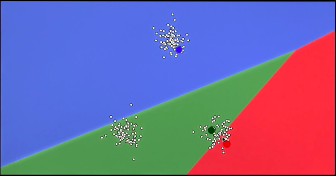
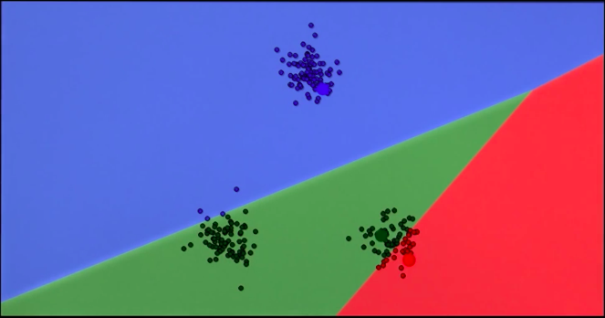
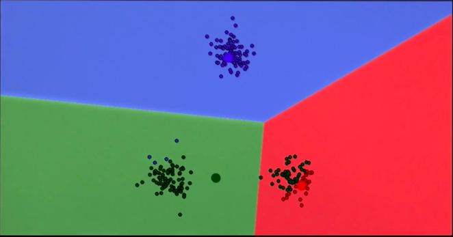
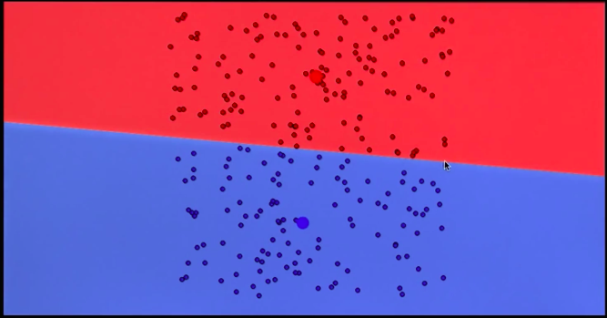
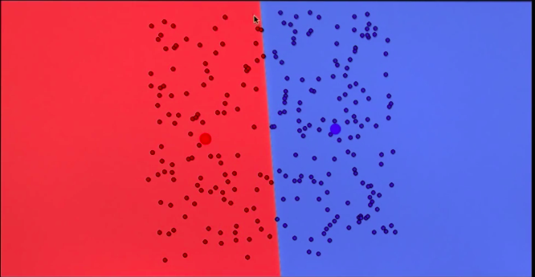
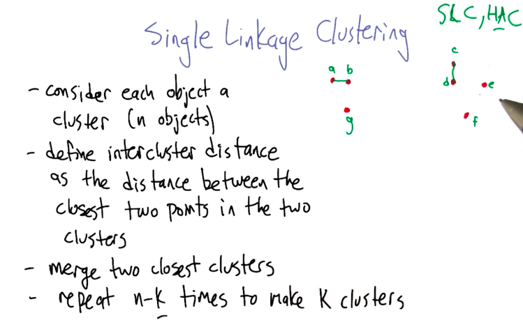
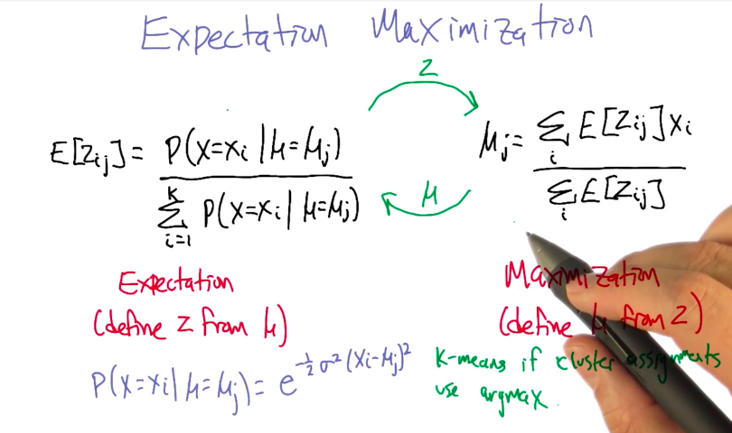
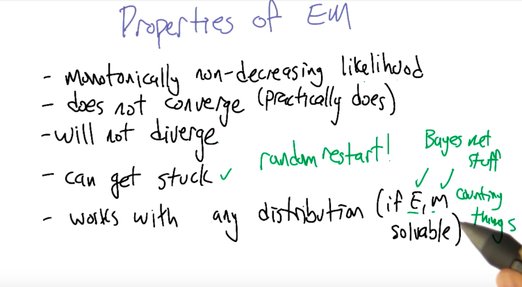

# Clustering

## K-Means

### K-Means Algorithm

1. Add `K` centroids to the data at random positions.



2. Associate each data point to the closest centroid (aka association step)



3. Move the centroids to the mean distance between all associated points



4. Repeat step 2 and 3 `n` times, or until some other stop-condition has been met.

### K-Means is not deterministic

The initial position of the centroids will influence the final outcome of the algorithm. See the example below:





To solve this problem, we run the algorithm multiple times and average the results.

### K-Means and sklearn

```python
class sklearn.cluster.KMeans(n_clusters=8, init='k-means++', n_init=10, max_iter=300, 
                             tol=0.0001, precompute_distances='auto', verbose=0, 
                             random_state=None, copy_x=True, n_jobs=1, algorithm='auto')
```

- `n_clusters`: number of centroids to initialize. Also defines the number of clusters to be found. This should be set using domain knowledge of the problem.
- `max_iter`: number of iterations (associate points, move centroids, repeat) to be run.
- `n_init`: number of times the algorithm will run before outputing the results.

### K-means references
- [Sci-kit learn documentation](http://scikit-learn.org/stable/modules/generated/sklearn.cluster.KMeans.html)
- [Visualizing K-means](https://www.naftaliharris.com/blog/visualizing-k-means-clustering/)


## Single Linkage Clustering

### Single Linkage Clustering Algorithm



## Soft Clustering


- Can assign the same point to multiple clusters
- Probabilistic approach

### Expectation Maximization



### Expectation Maximization Properties

