# Dimensionality Reduction

## Principal Component Analysis

### Definition

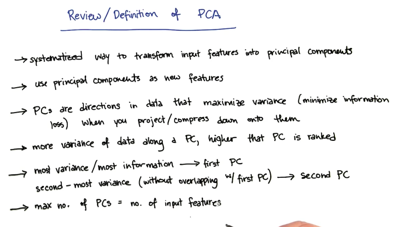

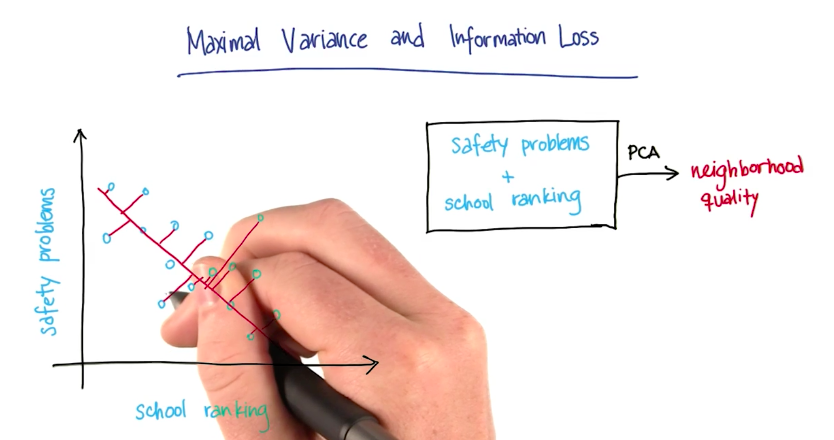

### When to use PCA

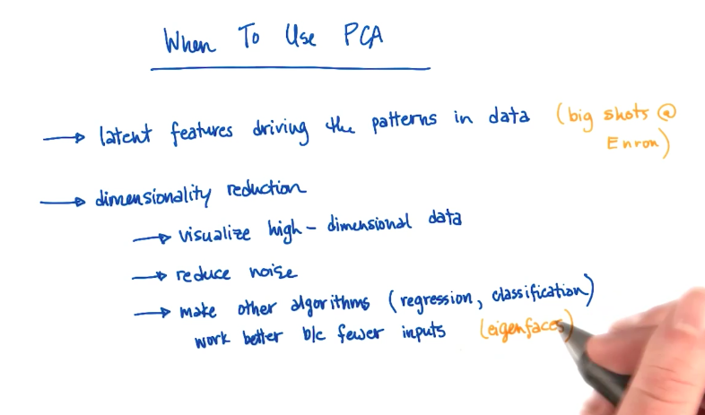

### PCA in sklearn

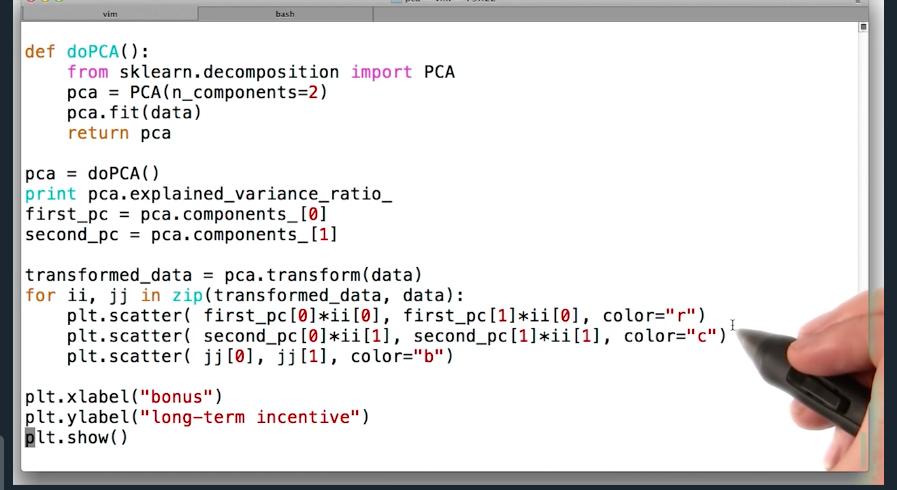

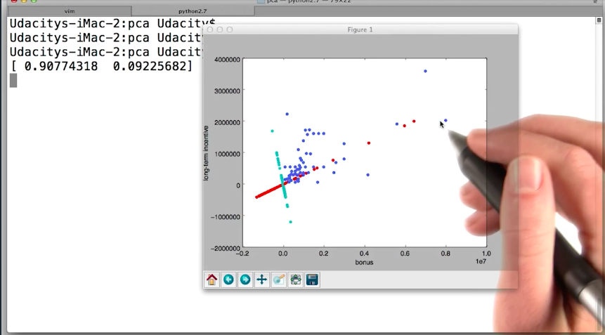

## Feature Transformation

### Definition

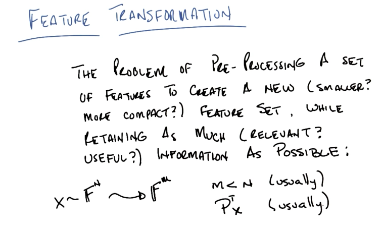

### Independent Component Analysis

Independent component analysis (ICA) is a method in which the goal is to find a linear representation of nongaussian data so that the components are statistically independent, or as independent as possible. [This paper](http://mlsp.cs.cmu.edu/courses/fall2012/lectures/ICA_Hyvarinen.pdf) describes ICA in detail. ICA has also been applied to the information retrieval problem, in a [paper](http://www.cc.gatech.edu/~isbell/papers/isbell-ica-nips-1999.pdf) written by Charles himself.

[The cocktail party demo](http://research.ics.aalto.fi/ica/cocktail/cocktail_en.cgi) is an example of ICA application

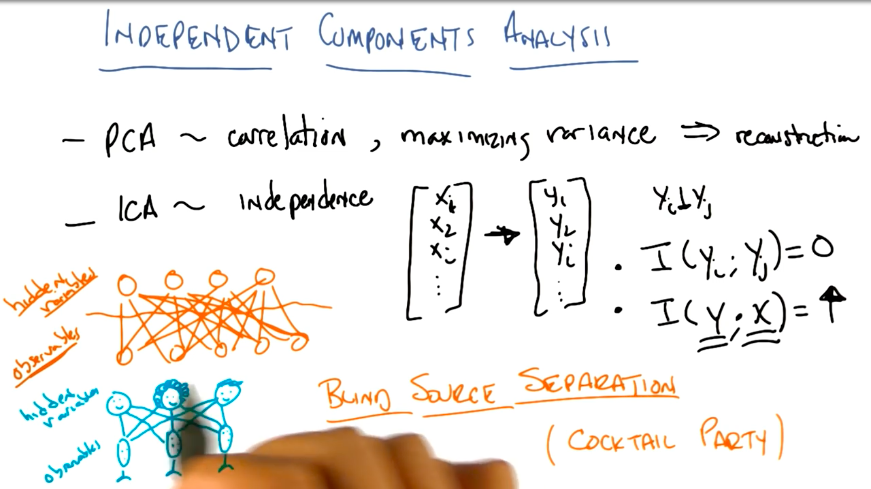

### ICA vs PCA

- ICA:
    - finds hidden features 
    - finds *statistically independent* features
    - maximizes mutual information
    - order between found features don't matter
    - works better on nongaussian distributions
    - is a probabilistic analysis
- PCA: 
    - decomposes the data onto orthogonal dimensions
    - maximizes variance
    - maximizes reconstruction
    - order between found features matters - former features cover more variance than latter features
    - works better on gaussian distributions
    - is a linear algebra analysis

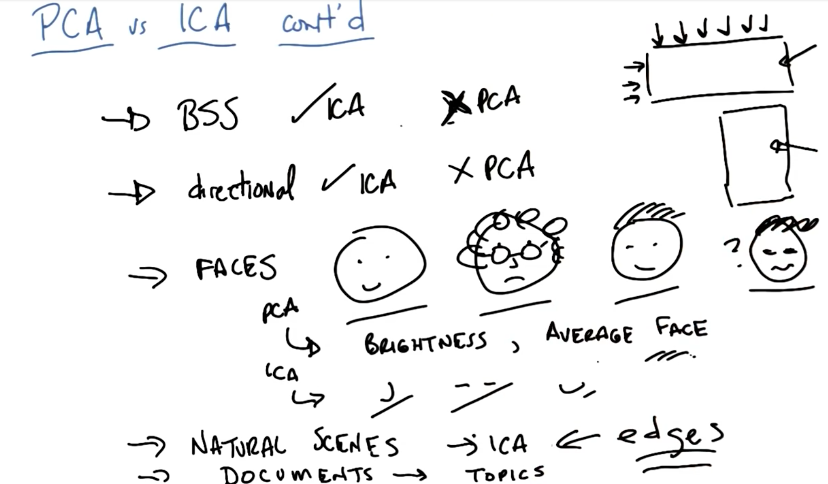

In the image above:
- *BSS* stands for Blind Source Separation problem (ie: Cocktail Party).
- Directional means that ICA input direction is meaningful. For example, ICA will output two different results for a matrix M and MT, while, PCA will output the same result for both inputs.
- Faces: PCA will find Brightness, then Average Face (*eigenfaces*), while ICA will find feature selectors like noses, mouths, eyes, etc.
- Natural Scenes: ICA will find edges.
- Documents: ICA will find topics.

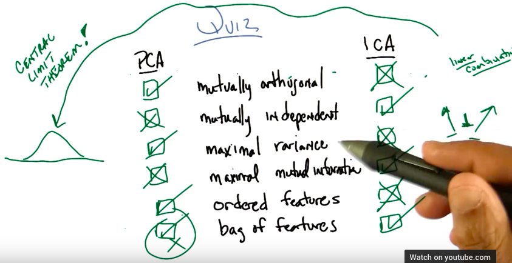

### Alternatives

- RCA: Random Component Analysis consists on projecting the data into random dimensions. It works in both cases, when M < N and also where M > N (for example: Kernel Methods)
- LDA: Linear Discriminant Analysis consists of using labels to find projections that summarize the data.

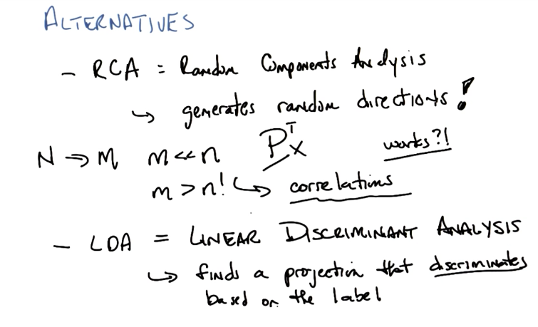

### Summary

[This excellent paper](http://computation.llnl.gov/casc/sapphire/pubs/148494.pdf) is a great resource for the Feature Transformation methods from this course, and beyond

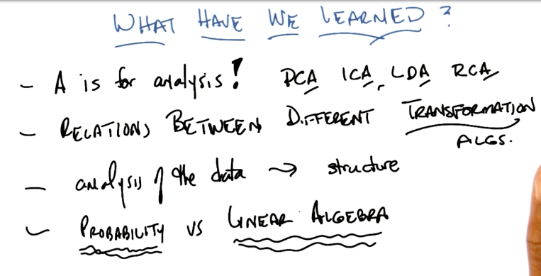