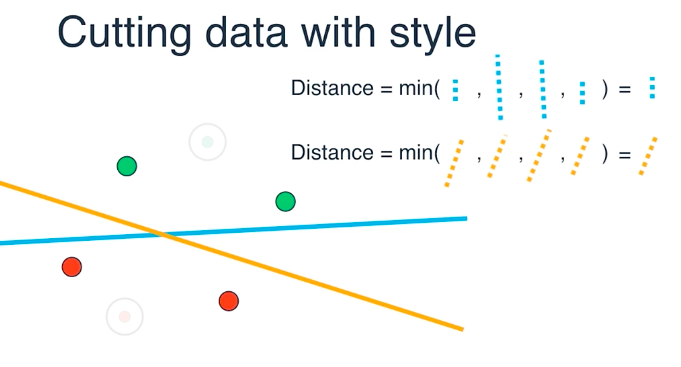
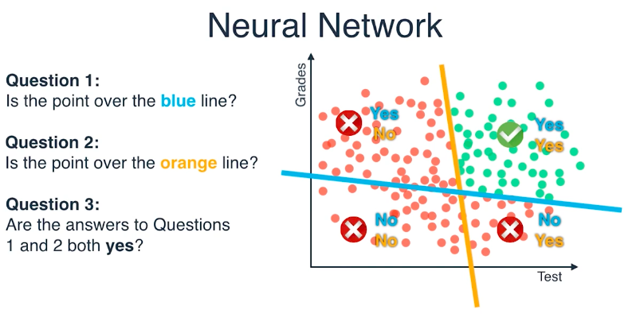
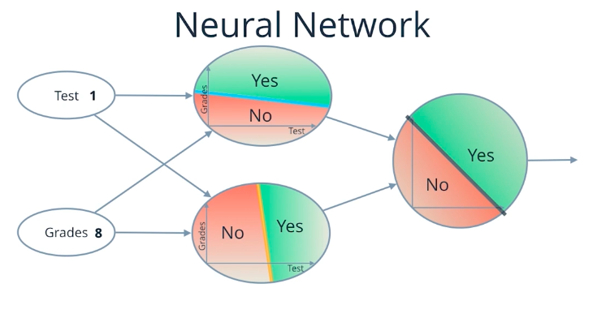
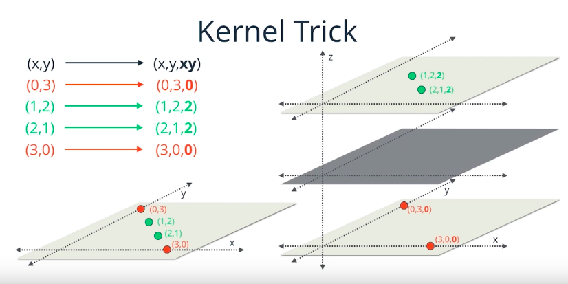
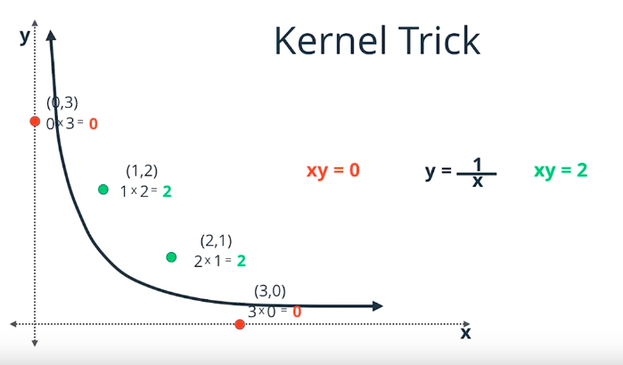

# Introduction

What is machine learning?

"In the world there are humans and machines. Humans learn from past experiences. Machines need to be programmed. Machine learning is programming a machine to learn from past experiences. And past experiences for machines are *data*"

# Decision Trees

Decision trees are a series of questions you ask at one's data to come to a decision. In the example, we built the questions about the features that had a nice split over the data. The data is below, and so is the compiled decision tree.

## Data

| Gender | Age | App Downloaded|
|--------|-----|---------------|
| F | 15 | Pokemon Go |
| M | 12 | Pokemon Go |
| F | 25 | WhatsApp |
| M | 32 | Snapchat |
| F | 40 | WhatsApp |
| M | 14 | Pokemon Go |

## Decision tree


# Naive Bayes

Naive Bayes classifier is probabilistic classifier that assumes that features observed are independent from each other, that is, there are no correlation between feature observed.

For example: suppose we're building a spam detector and we have a data set of 100 e-mails, 25 flagged as spam and 75 not spam. The word `cheap` appears in 20 out of the 25 spam emails, and only in 5 out of the 75 non-spam e-mails. From this, we can conclude that there is a 80% chance of an e-mail being spam if it contains the word `cheap`.

**Remark:** If the number of features tend to infinity, the Naive Bayes classifier will converge to 0, because the probability of features will always be < 1. Also, if a feature probability happens to be 0, it will wipe out all information being calculated.

# Gradient Descent

For each step, we evaluate all possible next steps and select the step that will maximize our current position towards our goal.

Example: while descending a mountain, we evaluate all next steps to choose the step that will take us closer to the base of the mountain, and so on, until we get to the base of the mountain.

# Linear Regression

We plot our data into a chart and draw a line that best fits all the points we plotted. The best fit is the line which minimizes the error. In this case, the error is the sum of the distances between the points and the line. To do this, we can use two techniques: Gradient Descent (has to deal with negative distances) and Least Squares (doesn't have to deal with negative distances - *real life usage*).

Example: assuming house prices are related to their square footage, estimate a house price given its square footage and 2 others houses prices, and square footage.

# Logistic Regression

We plot out data to a graph and each data-point. We then draw a line that best sepparate the two sets of points. This is also done using gradient descent. The error function is correlated to the misclassification and the proximity of points to the separation line.

Example: students previous grade and test grade for acceptance at a college. Given the two grades of a sample student and a data-set, we have to plot the sample data onto the graph and check if it is inside the acceptance region or not.

# Support Vector Machine

Given all possible lines that split a data set:
1. we identify the points close to these lines
2. then we discard the other points
3. we calculate the distances of the remaining points to each line
4. then we evaluate the minimal distances and select the line that has the largest minimal distance

To maximize the minimal distance we use gradient descent. The name Support Vector Machine is because the points close to the lines are called the "support".

Example:


# Neural Network

In a simple example, the instructor defined a neural network as a combination of multiple evaluations using previous known methods for splitting data set. His example basically consisted of independent nodes that plot their inputs into graphs and check if they are above or below some separating lines.






# Kernel Method

This method consists of identifying an auxiliary function that allow us to split the data, based on the auxiliary function. In a 2-D example, we had 4 points `red(0,3) green(1,2) green(2,1) red(3,0)`. From these points it was easy to identify the function f(x,y) = xy. Which then gave us the table:

|x|y|xy|
|-|-|--|
|0|3|0|
|1|2|2|
|2|1|2|
|3|0|0|

It is clear from the table that `xy = 1` splits the data in two sets.

We can then represent this data as curves or as planes.
```
xy = 0 -> red
xy = 1 -> frontier
xy = 2 -> green
```



